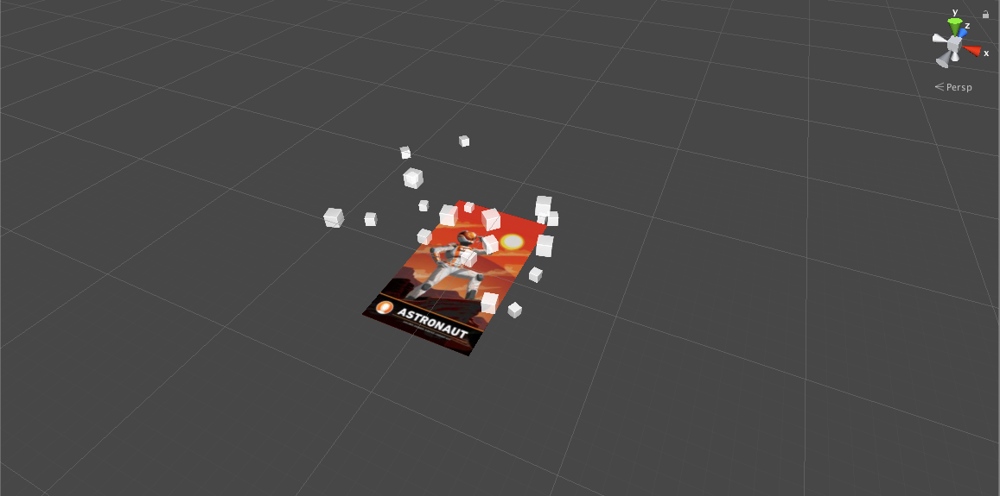
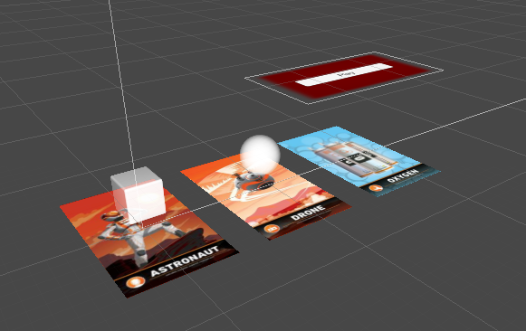
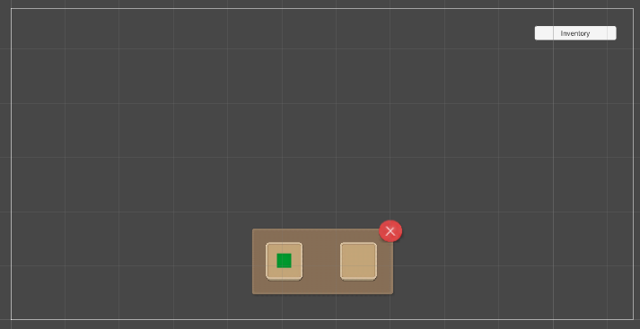

# AI ScavengAR Hunt
AR Scavenger Hunt for the University of Pennsylvania

## Overview
This goal of this application is to expose students and faculty to the wonders of Artificial Intelligence through an Augmented Reality scavenger hunt. 

## Requirements
A smartphone or tablet will be required to run this application.
- An iPhone or iPad running iOS9 or higher
- An Android running 4.4 or higher

## Development
### 2/11/18
One of the goals for today was to be able to manipulate objects that get projected through AR. I was able to find an asset on the Unity store called [Lean Touch](https://assetstore.unity.com/packages/tools/input-management/lean-touch-30111) that does just this and more. At this current state, I can move objects and scale them around the AR marker.

Here's a screenshot of the current state. Users can click on as many cubes as they want and move/scale them to their liking.

Build: MoveObjects1

### 2/12/18
Goal: Game management, player, inventory systems

Today I was able to implement a basic inventory UI and multiple targets. This is the basis of the game. Each marker will have a different object or video associated with it for the player to collect. What I want to get working is to make the objects more interactive. The objects can move and scale based on the yesterday's work. To combine that with the UI requires double clicking, which I wasn't able to figure yet.

When users collect items, they'll show up in the inventory. Users can access this at any time by clicking the inventory button on the top right and exit with the close button. Something to look forward to with this is bringing the objects back into the scene and playing around with it. If we go with building the robot route, this might have to come into play or an animation will play snapping the piece to the robot. 

Bugs
- *Double Click* - If you move the cube and then deselect, it wont' select again.

**TODO**
- Double Click
- Video

Build: MoveObjects2, MoveObjects3

### 2/13/18
Met with Dr. Lane and Dr. Arriata to discuss the project further. We settled on a way to make the scavenger hunt more enticing for players. Each poster they go to provides them with a power up. This power up will make the game easier as they progress. In order to be able to win prizes, the player must get the top three scores of the night. 

See [Workplan](workplan.md) for more details.

### 2/14/18
*Note: You have to turn off render from webcam in the Vuforia project settings.*

Today's goal was to set up Space Invaders with rigid bodies. This didn't take too long as I already had made a version last semester. Messing with the rigid bodies to get the behavior that I wanted took a little bit of time mainly because I forgot that I turned off collisions for bullet-player and never turned it back on. The next goal is to port this to AR.

Here's how the game starts.

Here's a screenshot with the rigid body dynamic.

Scene:
- SpaceInvaders

Classes created:
- `SpaceInvadersManager`
    - Manages enemy movement
- `PlayerController`
    - Manages player input for movement and shooting
- `Enemy`
    - Manages collisions and shooting
- `BulletBase` 
    - Manages movement
    - `Bullet`
    - `EnemyBullet`

**TODO**
- Move enemies down 
- Move to AR
- Check bullet-bullet interaction
- Player lives
- Win/lose

### 2/15/18

## Resources
- [Unity 2017.3](https://unity3d.com/)
- [Vuforia](https://www.vuforia.com/)
- [Lean Touch](https://assetstore.unity.com/packages/tools/input-management/lean-touch-30111)