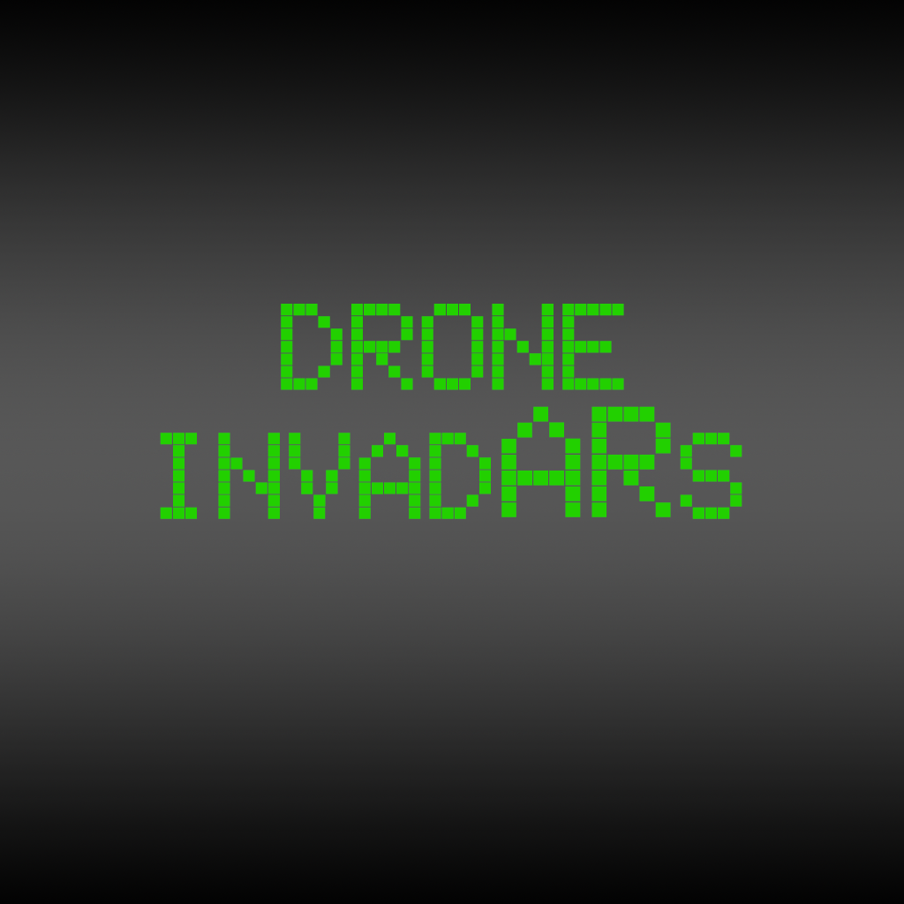
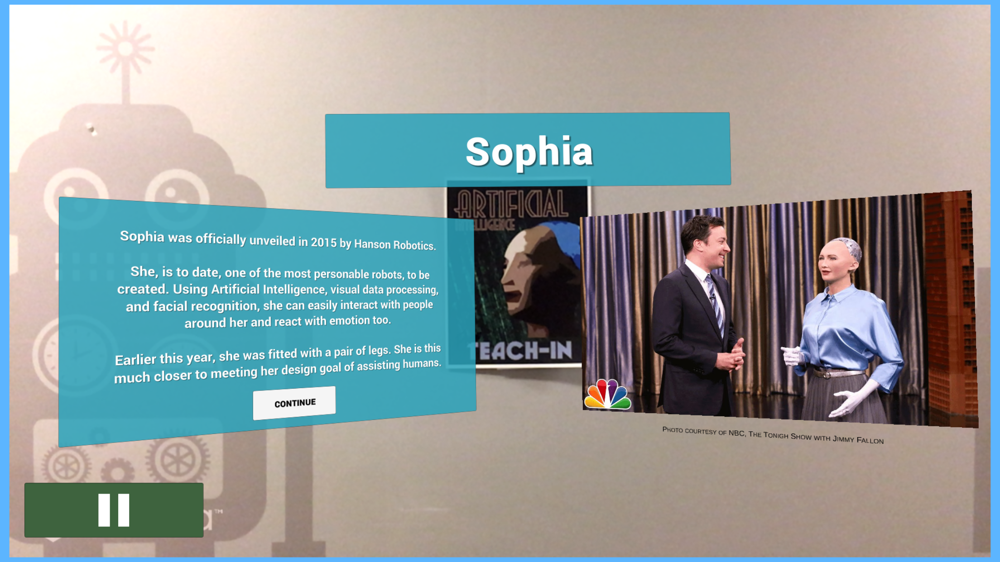
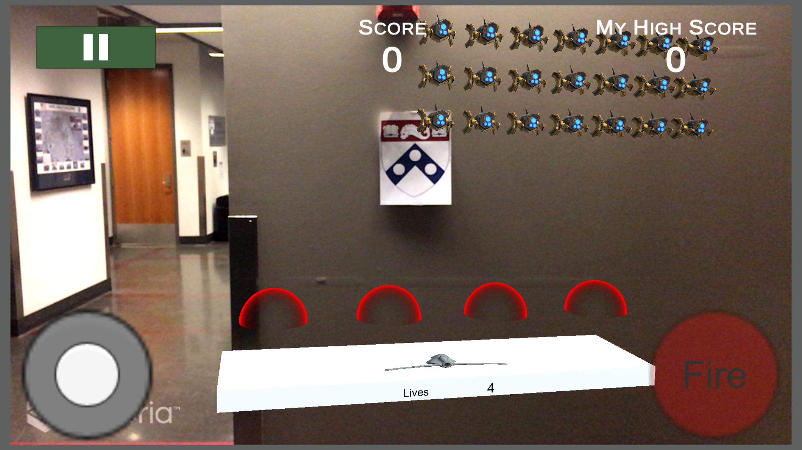

# ScavengAR Hunt

## Overview
This goal of this application is to expose students and faculty to the wonders of Artificial Intelligence through an Augmented Reality scavenger hunt during Penn's Teach-In event. 2018 is the first year since 1969 that Penn is hosting a [Teach-In event](http://pennteachin.org).

I also designed the stylized posters used as the image targets for the event. They are available [here](http://JonLee.xyz/TeachIn)

To handle AR, I used the Vuforia package in Unity. Unity was also an obvious choice to develop for both iOS and Android with tight time constraints.

### Where to download

[App Store](https://itunes.apple.com/us/app/penn-scavengar-hunt/id1357409012?ls=1&mt=8) | 
[Google Play](https://play.google.com/store/apps/details?id=com.JonathanLee.DRONE) 

#### Requirements
- iOS 9 or higher
- Android 4.1 or higher

## Gameplay
The game is broken down into two games: the hunt and Drone InvadARs. 

### The AI Hunt
Image targets were placed all around the School of Engineering. Each image target had a short tidbit about some of the milestones in artificial intelligence. 

The hunt starts at the ENIAC, because without it, none of this would be possible.

The other goal was to participants unfamiliar with the building to visit different labs and learn about some of their research.

GRASP Lab (Robotics)

SigLab (Computer Graphics)

AddLab (3D Printing)

At each location, players receive a piece of the puzzle. Some items give powerups for Drone InvadARs.

### Drone InvadARs

Drone InvadARs is an augmented reality spin on Space Invaders. The idea behind this was to be able to have clear winners for the prizes at the end of the night.

Players needed to find any Penn Shield to activate the game. Initially players start off with Level 1 shields and 3 lives. As they progress through the scavenger hunt and collect items, their shields can reach up to Level 3, which can take more hits before being destroyed and allow them to potentially get a higher score.

A simple registration system and leaderboard was created using [dreamlo](http://dreamlo.com).

#### Bugs
When viewing the leaderboard, the scores sometimes won't update when the player gets a high score. Based on different Unity forum posts, I found that this has to do with a mobile request timeout. Because of this, the leaderboard option is only available on Android. The app was rejected several times because this was considered a *crash* to Apple. Instead, I allowed iOS players to view the leaderboard on my website on the night of the event.

## Resources
- [Unity 2017.3](https://unity3d.com/)
- [Vuforia](https://www.vuforia.com/)
- [Lean Touch](https://assetstore.unity.com/packages/tools/input-management/lean-touch-30111)