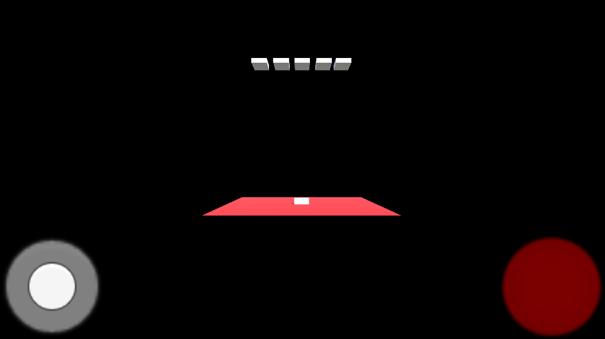
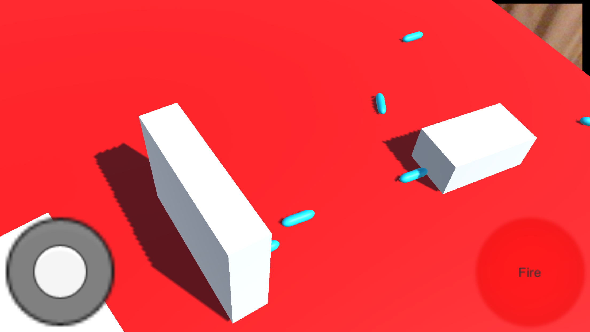
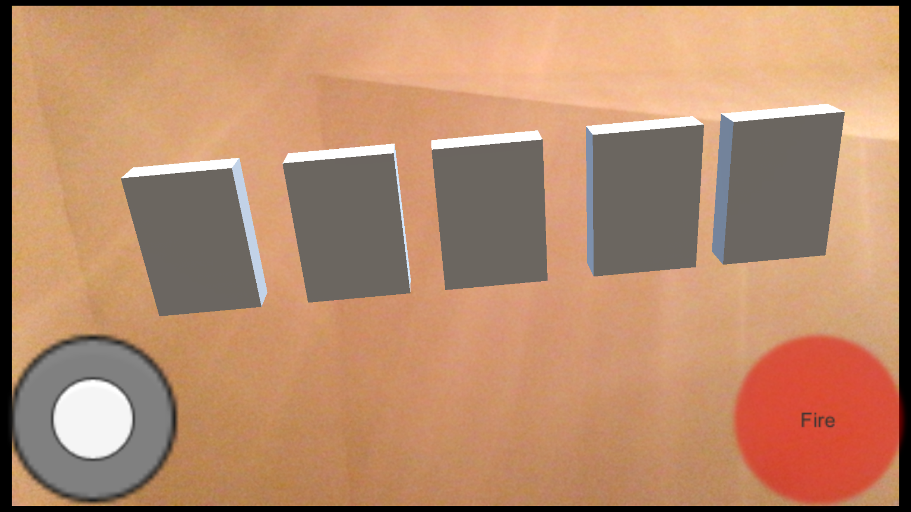
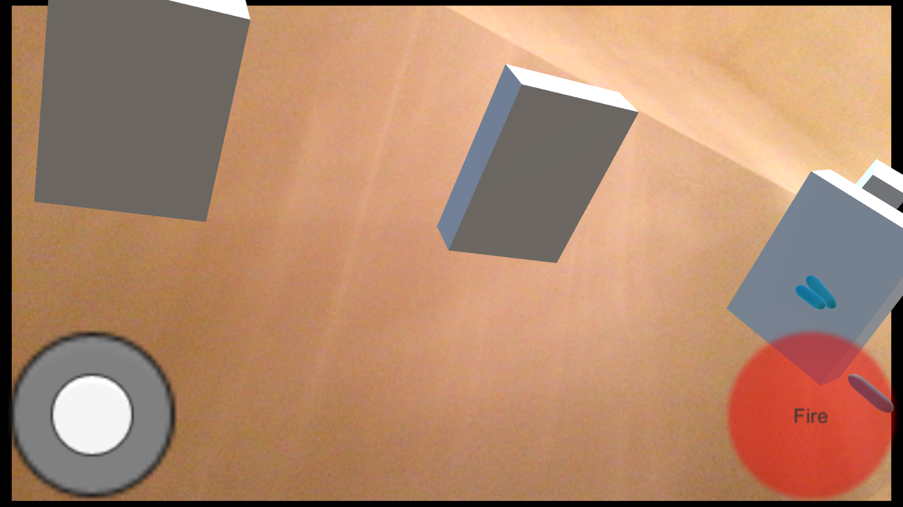

# AI ScavengAR Hunt
AR Scavenger Hunt for the University of Pennsylvania

## Overview
This goal of this application is to expose students and faculty to the wonders of Artificial Intelligence through an Augmented Reality scavenger hunt. 

## Requirements
A smartphone or tablet will be required to run this application.
- An iPhone or iPad running iOS9 or higher
- An Android running 4.4 or higher

## Development
### 2/11/18
One of the goals for today was to be able to manipulate objects that get projected through AR. I was able to find an asset on the Unity store called [Lean Touch](https://assetstore.unity.com/packages/tools/input-management/lean-touch-30111) that does just this and more. At this current state, I can move objects and scale them around the AR marker.

Here's a screenshot of the current state. Users can click on as many cubes as they want and move/scale them to their liking.

Build: MoveObjects1

### 2/12/18
Goal: Game management, player, inventory systems

Today I was able to implement a basic inventory UI and multiple targets. This is the basis of the game. Each marker will have a different object or video associated with it for the player to collect. What I want to get working is to make the objects more interactive. The objects can move and scale based on the yesterday's work. To combine that with the UI requires double clicking, which I wasn't able to figure yet.

When users collect items, they'll show up in the inventory. Users can access this at any time by clicking the inventory button on the top right and exit with the close button. Something to look forward to with this is bringing the objects back into the scene and playing around with it. If we go with building the robot route, this might have to come into play or an animation will play snapping the piece to the robot. 

Bugs
- *Double Click* - If you move the cube and then deselect, it wont' select again.

**TODO**
- Double Click
- Video

Build: MoveObjects2, MoveObjects3

### 2/13/18
Met with Dr. Lane and Dr. Arriata to discuss the project further. We settled on a way to make the scavenger hunt more enticing for players. Each poster they go to provides them with a power up. This power up will make the game easier as they progress. In order to be able to win prizes, the player must get the top three scores of the night. 

See [Workplan](workplan.md) for more details.

### 2/14/18
*Note: You have to turn off render from webcam in the Vuforia project settings.*

Today's goal was to set up Space Invaders with rigid bodies. This didn't take too long as I already had made a version last semester. Messing with the rigid bodies to get the behavior that I wanted took a little bit of time mainly because I forgot that I turned off collisions for bullet-player and never turned it back on. The next goal is to port this to AR.

Here's how the game starts.

Here's a screenshot with the rigid body dynamic.

Scene:
- SpaceInvaders

Classes created:
- `SpaceInvadersManager`
    - Manages enemy movement
- `PlayerController`
    - Manages player input for movement and shooting
- `Enemy`
    - Manages collisions and shooting
- `BulletBase` 
    - Manages movement
    - `Bullet`
    - `EnemyBullet`

**TODO**
- Move enemies down 
- Move to AR
- Check bullet-bullet interaction
- Player lives
- Win/lose

### 2/15/18
**Goals:**
- ~~Move enemies down~~
- ~~Check bullet-bullet interaction~~ *This should be inherent*

**TODO**
- Move to AR
    - Look into how other AR shooters work to make this as seemless as possible.
- Player lives
- Win/lose

### 2/17/18
I was able to port Space Invaders to AR. I utilized Vuforia's Ground Plane detection. This allows users to play anywhere as long as they specify the horizontal plane. 

There was an issue with Vuforia's
[Ground Plane Documentation](https://library.vuforia.com/articles/Solution/ground-plane-guide.html). When using their `DeployStageOnce` script, the Plane Finder doesn't call `OnInteractiveHitTest()`. To fix this, go to `Plane Finder->Plane Finder Behavior->Advanced`. Then drag the Plane Finder game object to the empty slot and set the function to `DeployStageOnce.OnInteractiveHitTest()`. This solution was found in [Matthew Hallberg's Tutorial](https://www.youtube.com/watch?v=0O6VxnNRFyg).

**Notes**
- The default set up for Vuforia's ground plane creates a new ground plane and object each time the user taps the screen. This was modified using the official Vuforia tutorial on ground planes. 
- Another modification I set up was to allow LeanTouch to work. Whenever you set the position for tracking and then touch the joystick/fire buttons, the ground plane would move to that spot and would require you never lift your finger after setting the ground to use the buttons. In the `DeployStageOnce` script, I just set a flag for when the ground plane gets set so it doesn't reset after the first time.

View from Unity Editor

In game looking at the player (on the right)

Looking up at the enemies

Hitting an enemy

**Bugs**
- Game itself is way too big. Need to scale this down.
- The game is currently scaled to iPhone 6 plus screens.

**TODO**
- Get the tracker to find the horizontal plane to work.
- Player lives
- Win/lose
- Score count
    - Write to databse
- Test first person mode rather than moving the player ship. 

### 2/27/18
So a lot of my time was spent working on the ground plane. I realized really late that this was unsupported on a lot of devices. I resorted back to the image target AR experience. 

Classic Space Invaders is level one. Drones flying around will be level two. Added a simple professor page that loads a power up. I have to write a manager script for the entire game in order for this to have any effect. 

**TODO**
- RNG for enemy shots.

### 3/4/18
Completed:
- Menu
- Login/Registration
- High scor database

Resources:
- [dreamlo](http://dreamlo.com/) for database
- [TextMeshPro](https://assetstore.unity.com/packages/essentials/beta-projects/textmesh-pro-84126) for high quality texts

### 3/5/18

Once Vuforia is enabled in one scene, it gets enabled for every scene, even if you don't want it there. To get around this, I had to add a `Vuforia Behavior` script to each camera and disable it in the inspector. 
[Unity Forum Post](https://forum.unity.com/threads/do-not-run-vufory-when-the-application-starts.498351/)

Fixed issue with main menu. Added a continue overlay. The player can change their email address or reregister on the same device.

Removed `PlayerStats.cs` completely. Too much to fiddle around, resorting to `PlayerPrefs` instead. Scores get updated to the server whenever the player beats their own score. 

**Bugs**
- Can't see high scores if player beats it
- You need to restart the app

## Resources
- [Unity 2017.3](https://unity3d.com/)
- [Vuforia](https://www.vuforia.com/)
- [Lean Touch](https://assetstore.unity.com/packages/tools/input-management/lean-touch-30111)